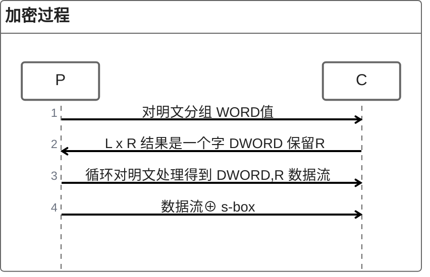
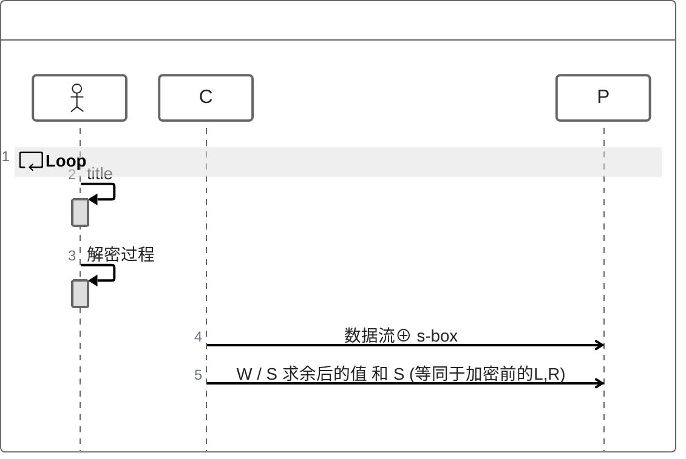

# WipeID

> 基于流密码设计，密钥流的随机性参考 RC*算法;   
>
> 加密方式基于原先RC4单纯的异或 代数加法运算更改为 乘法运算。
>
> RC4算法  S-box 范围的256，不安全, 使用一个变量和  s-box  来随机化密钥流。

> todo:    想到了更好的tips在修改把

* 引入随机数 nonce
* 使用非线性反馈移位寄存器保证  one-time pad


## How to use

```c#
// unit.test   Example_HowtoUse method
using (WipeID wi = new WipeID())
{
    wi.SetCipherStream("this is key");
    byte[] input = new byte[]
    {
        0x90,0x90,0x90,0x90,
        0x90,0x90,0x90,0x90,
    };
    using (MemoryStream outs = new MemoryStream())
    {
        byte[] output = wi.Encrypt(input,outs);

        using (MemoryStream outs2 = new MemoryStream())
        {
            CollectionAssert.AreEquivalent(input, wi.Decrypt(output, outs2));
        }
    }
}
```


## 优缺点

> 优点
>
> 基于乘法运算可以极大的混乱原始痕迹，比如字符串加密时消除明文字符，这一点是古典密码中无法具备的
>
> 对于异或门加密，因为**密钥的固定或密钥在Galois Field  伽罗瓦域即有限域**内，对于抗穷举效果不太好。
>
> 使用乘法运算，配合加法，并且扩大了密钥流的范围，仅用作学习目的。
>
> 缺点
>
> 作者数学基础薄弱，算法本身可能存在问题，不建议在严格保密场景下使用。但作为chacha20替代在一线和木马流量加密场景下不需要引用第三方库。（只要密钥流随机性不可预测，流密码的优势还是有发挥余地的）
>
> 因为使用乘法对原始数据进行了操作，不能算是标准的流密码模式


## Algorithm

### 密钥流生成器

> 密钥流生成参考 RC*算法
>
> 扩充了密钥流范围 > 256

### 加解密算法

> **简单说明文以 WORD  2字节（即一个字）进行处理**

> 明文记作： P
>
> 密文记作： C
>
> 一个加密单元（一个字）的两个字节记作：   L,R  (left,right)           



> 解密过程
>
> 解密过程则是以3个字节为一个单位：  WORD  /  byte3   =  WORD
>
> WORD 字记作： W
>
> byte3 记作： S   (shadow)



> 异常情况:
>
> 由于除数不能为0，在加密时会判断 L,R是否为0， 有一个为0，不做处理。后续进入  ⊕  s-box阶段处理0字节数据
>
> 对于明文长度不足  WORD整数倍的， 最后一个字节同理不处理


### 说明

> 以上只是非常简单的实现，如何利用强大的数学公式和某些特殊的超越数 (无理数) 优化例如  AES CTR模式中  IV 自增形式的 one-time pad  作为学习吧。


